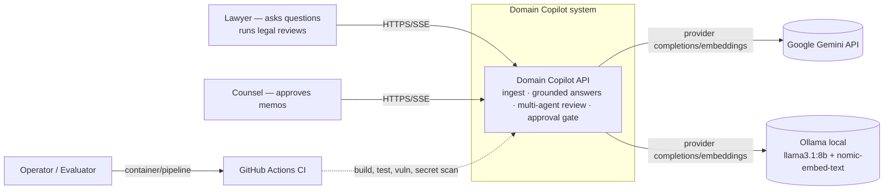
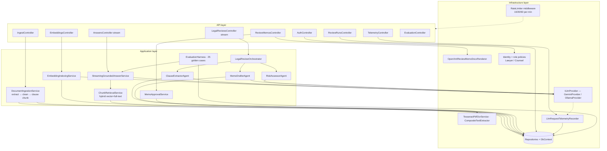
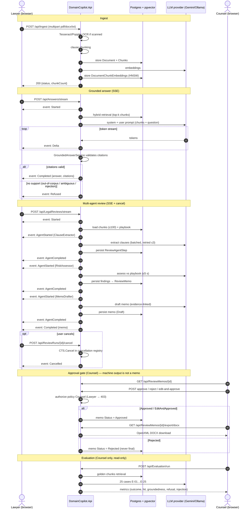
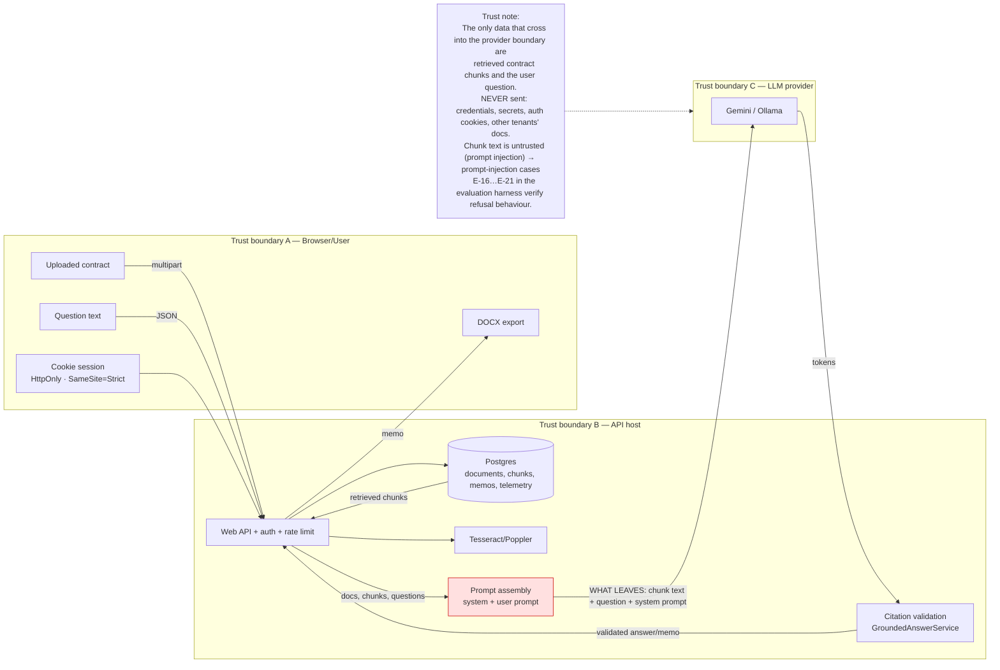
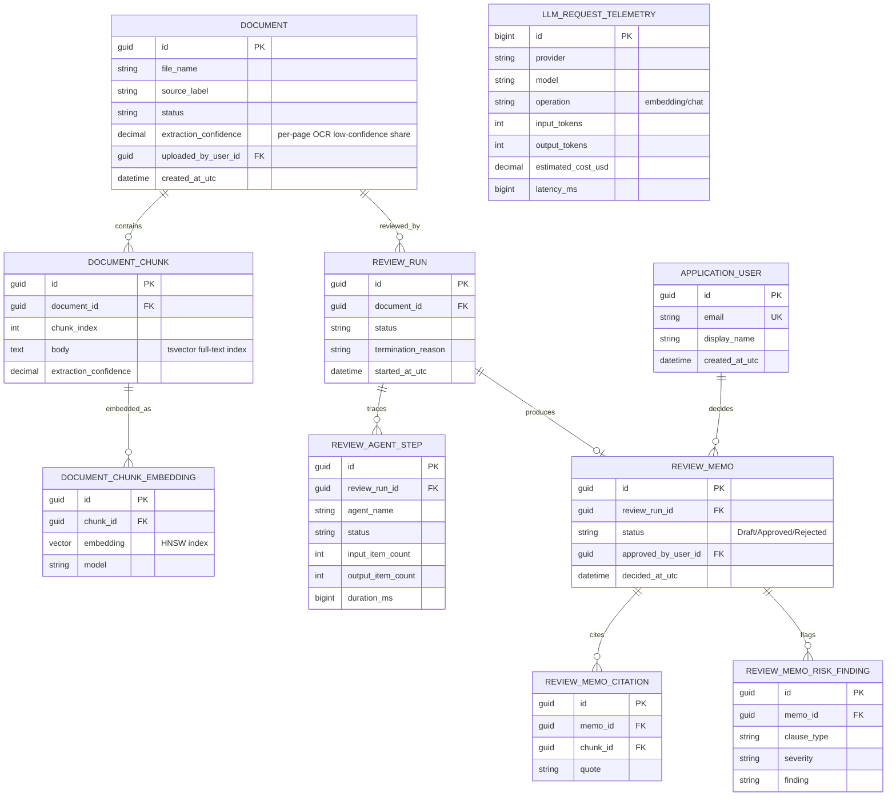
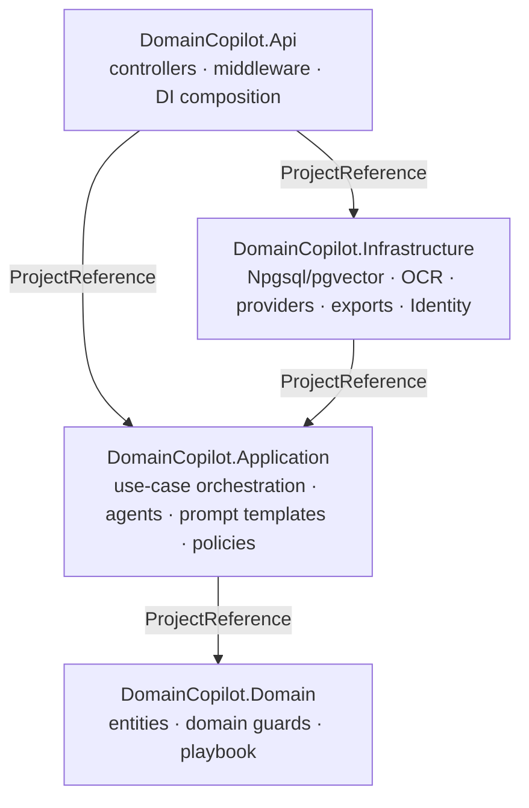
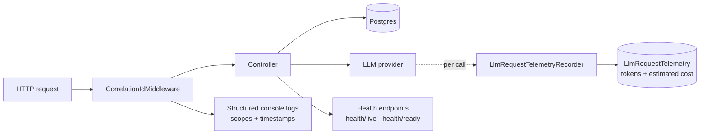

# Architecture — Domain Copilot

> **Status:** current for the shipped MVP (September 2026). Companion to
> `docs/SYSTEM-DESIGN.md` (target architecture + gap analysis). All diagrams
> below are committed **as Mermaid sources** (rendered by GitHub) so the
> diagrams are versioned with the code, per the deliverable requirement
> "diagram source committed, not only images".
>
> ADR register (extended reasons): `docs/adr/0001–0008`.

---

## 1. System context (C4 — Level 1)



**Actors:** `Lawyer` (creates documents, asks, runs reviews, exports),
`Counsel` (approval gate only), `Operator/Evaluator` (deploys, runs the
25-case golden harness). Providers: Gemini (primary), Ollama (local
fallback). CI: GitHub Actions.

---

## 2. Containers (C4 — Level 2)

```mermaid
flowchart TB
    subgraph Browser
        ui[Static SPA<br/>wwwroot: index.html · site.css · app.js]
    end

    subgraph Container[Docker Compose stack]
        api[DomainCopilot.Api — ASP.NET Core 9 / Kestrel<br/>controllers · SSE streaming · static files<br/>port 8080]
        ocr[Tesseract + Poppler<br/>in-image binaries]
        pg[(PostgreSQL 16 + pgvector 0.x<br/>HNSW + GIN · 9 EF migrations)]
    end

    subgraph Providers[LLM providers]
        gemini[Google Gemini API]
        ollama[Ollama server<br/>localhost:11434]
    end

    ui -->|same-origin /api| api
    api --> ocr
    api -->|Npgsql| pg
    api -->|FallbackLlmProvider: gemini-primary<br/>ollama-fallback (or reversed)| gemini
    api -->|FallbackLlmProvider| ollama
```

**Key container decisions** (ADR-referenced): a single API container serves
both the static UI and the JSON/SSE API (`UseDefaultFiles` + controllers);
Postgres runs in its own container with a health gate; OCR binaries live in
the API image (no service boundary needed yet — see G-03 broker gap in
`docs/SYSTEM-DESIGN.md`); the DB is the only stateful component.

---

## 3. Components (C4 — Level 3, inside the API)



---

## 4. Sequence diagram — full agentic workflow (ingest → answer → review → approval → export)

The approval gate and streaming are first-class; SSE event names below are
the actual wire events (`GroundedAnswerStreamEventType`,
`LegalReviewProgressEventType`).



---

## 5. Data-flow diagram with trust boundaries



**What the LLM provider sees** (explicitly): the system prompt
(`PromptTemplate.Version`), the user's question, and the *retrieved* chunk
text of the document being processed for that request — nothing else.
Injection defense is layered: (1) chunk text is data, not instructions, in
prompt assembly; (2) `GroundedAnswerService` **enforces** that citations come
from retrieval results — the model cannot cite what was not retrieved;
(3) the golden harness verifies refusal under direct/indirect injection.

---

## 6. ER diagram (core domain, key fields)



**Migrated columns are authoritative** (9 EF migrations in
`src/DomainCopilot.Infrastructure/Persistence/Migrations`); the diagram shows
the stable core, with Identity tables (`ApplicationUser`, roles) from the
`AddIdentityAuthentication` migration.

---

## 7. Layer-dependency diagram



- **Domain**: entities + domain rules (e.g., `ReviewMemo` refuses decisions on
  non-draft memos — the approval gate invariant lives in the domain, not the
  controller).
- **Application**: use cases, the three agents, the grounded-answer service,
  evaluation harness, interfaces (ports).
- **Infrastructure**: adapters — EF/Npgsql, Tesseract/Poppler, LLM providers,
  OpenXML export, Identity storage, telemetry recorder.
- **Api**: composition root, controllers, middleware, streaming endpoints.
- Dependencies point **inward only**; Application never references
  Infrastructure (testability + the reason the Application test project needs
  no database).

---

## 8. ADR register (architecture decision records)

All ADRs: `docs/adr/`.

| # | Decision | One-line rationale |
|---|---|---|
| 0001 | Provider abstraction (`ILlmProvider` + fallback chain) | Gemini outage/quota must degrade to Ollama, not fail the product |
| 0002 | Clause-aware chunking strategy | legal structure (recitals/definitions/obligations) beats fixed-size pieces for both retrieval and review |
| 0003 | Embedding + hybrid retrieval (vector + GIN full-text) | exact-entity queries (clause names/§ numbers) need lexical match; semantic similarity needs vectors |
| 0004 | Grounded answers with enforced citations | untrusted document text must not steer answers; citation validity is enforced in `GroundedAnswerService` |
| 0005 | Pipeline agent orchestration (extractor → assessor → drafter) | one model call cannot both inventory clauses and write a defensible memo; separate roles → separate telemetry and retries |
| 0006 | Human approval gate (`Counsel` policy) | machine-written memos are advice candidates, not legal deliverables; `MemoApprovalService` + role policy enforce it |
| 0007 | OCR export and API security | scanned PDFs need real OCR (not "no text" failures) and the API constrains uploads/export surface |
| 0008 | Identity cookie authentication (HttpOnly, SameSite=Strict, Secure-on-HTTPS) | cookie session + roles gives policy-grade gates with the smallest XSS/storage surface for a same-origin SPA |

---

## 9. Observability and trace flows



- **Per-run trace**: `ReviewRuns` + `ReviewAgentStep` rows → replayable via
  `GET /api/ReviewRuns/{id}` (see `docs/RUN-TRACE.md`).
- **Per-LLM-call telemetry**: provider, model, operation, tokens, latency,
  `EstimatedCostUsd` when pricing configured → `docs/OBSERVABILITY.md`.
- **Health**: `/health/live` (always ok) and `/health/ready` (DB ping) drive
  the compose health gate and can drive orchestrator probes later.

---

*Diagrams are Mermaid sources in this committed file — regenerate/render
locally with `mmdc` or on GitHub. For the target architecture and the honest
gap analysis, see `docs/SYSTEM-DESIGN.md`.*